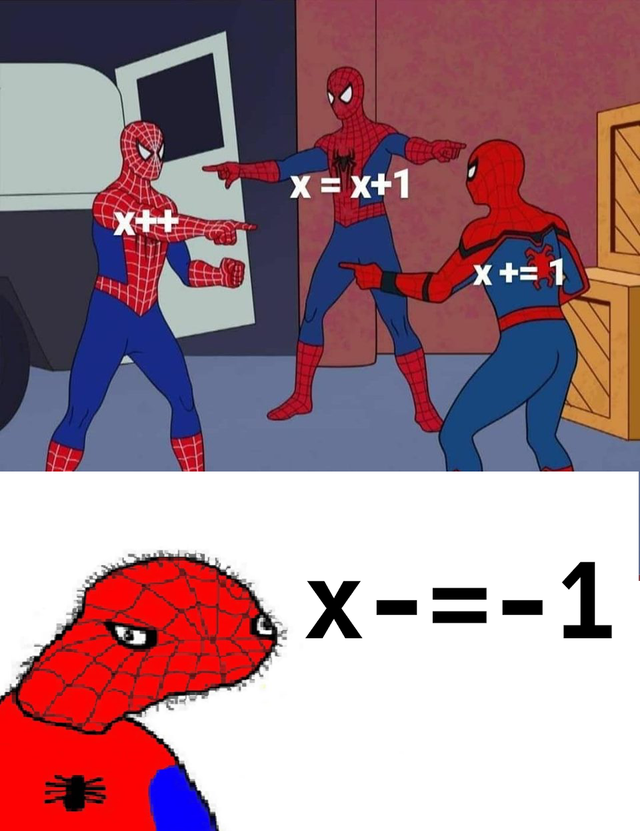

# Tutorial 3 Notes

1. Which of the following variable names are valid? Which of them are good?

    1. THX1138
    2. 2for1
    3. mr_bean
    4. my space
    5. event_counter
    6. ^oo^
    7. _MEMLIMIT
    8. return

<details>
    <summary>Answer</summary>

    The ones that are valid are 1, 3, 5 and 7. For variable names to be valid, they must only have letters, numbers and underscores, and they must either start with a letter or an underscore.

    The ones that are possibly good are 3 and 5 if the name is relevant to its purpose. For variable names to be good, they must follow one of the naming conventions of snake_case or camelCase and it must be relevant to its purpose.
</details>

<br>

2. What's wrong with these while loops?

a. 
    
```c
int i;

while (i < 100) {
    printf("%d\n", i);
    i = i + 1;
}
```

<details>
    <summary>Answer</summary>

    i is not initialised and so will throw a compiler error. 
        
    When we think about this code, if i's value is unknown and unclear, how could (i < 100) possibly work?
</details>

<br>

b. 

```c
int i = 0;
int j = 0;

while (j = 1 || i < 100) {
    printf("%d\n", i);
    i = i + 1;
}
```

<details>
    <summary>Answer</summary>

    In the while condition, (j = 1) is an assignment, not a condition. DCC will warn you about this and tell you that you probably want (j == 1).

    **Bonus**. Last week, we learnt if conditions result into 1s and 0s. While conditions are the same and if an assignment (such as (j = 1)) is successful, it will return 1. Hence, this is an infinite loop.
</details>

<br>

c.

```c
int i = 0;
int n = 10;
while (i < n) {
    printf("%d\n", i);
    n = n + i;
    i = i + 1;
}
```

<details>
    <summary>Answer</summary>

    This is an infinite loop because i grows faster than n, and so, the while condition will never be false.
</details>

<br>

d. 

```c
int i = 0;
while (i < 10)
    printf("%d\n", i);
    i = i + 1;
```

<details>
    <summary>Answer</summary>

    Since there are no curly braces, the while condition only affects the line of code right after it. Hence, the output will be an infinite amount of 0s.
</details>

<br>

When writing while loops, we have to remember three things:
1. The structure: while (condition) {code statements}
2. The condition actually makes sense.
3. The condition is being changed in the while loop. (Incrementing!)



<br>

**Divisible within a range example**

Last week, we talked about planning code! Now we will build upon simple code to make more complex code.

3. We want to print all the numbers divisible by 7 between 1 and 20.

<br>

4. We want to print all the numbers divisible by 7 between 1 and 100.

<br>

5. We want to print all the numbers divisible by 7 between 1 and an end determined by the user.

<br>

6. We want to print all the numbers divisible by 7 between a start and an end determined by the user.

<br>

7. We want to print all the numbers divisible by a divisor between a start and an end, all determined by the user.